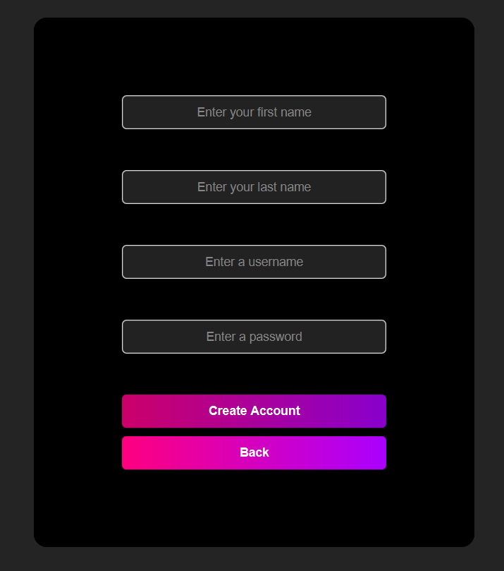
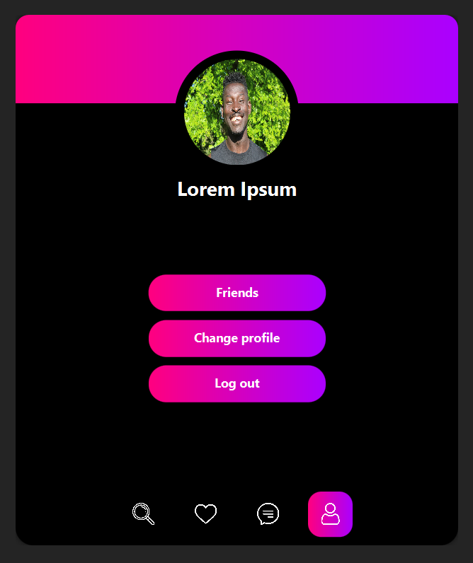

# Fakegram

Fakegram is a social networking application where users can create accounts, add friends, send and receive messages, and manage their profiles. The application is designed with a clean and modern interface using JavaFX for the frontend and Java for the backend. It relies on PostgreSQL as its database.

---

## Features

### User Management
- **Account Creation**: Easily create a profile with your personal details.
- **Login System**: Secure authentication to access your account.

### Social Features
- **Friend Management**: Add friends, receive friend requests, and accept or reject them.
- **Notifications**: Get real-time notifications for friend requests.
- **Messaging**: Chat with friends and reply to their messages.

### Profile Customization
- **Edit Profile**: Update your name, add a bio, or change your profile picture.

---

## Technology Stack

- **Frontend**: JavaFX
- **Backend**: Java
- **Database**: PostgreSQL

---

## Installation Instructions

To set up and run the Fakegram application, follow these steps:

### Prerequisites
1. **PostgreSQL**: Install PostgreSQL and set up a database.

### Steps

1. **Clone the Repository**:
   ```bash
   git clone https://github.com/your-username/fakegram.git
   cd fakegram
   ```

2. **Set Up PostgreSQL Database**:
   - Create a new PostgreSQL database.
   - Update the `application.properties` file with your database credentials.

   ```properties
   spring.datasource.url=jdbc:postgresql://localhost:5432/your-database-name
   spring.datasource.username=your-username
   spring.datasource.password=your-password
   ```

3. **Build and Run the Application**:
   - Use your IDE or command line to compile and run the application.

   ```bash
   mvn javafx:run
   ```

   - If java-23-openjdk and mvn are not installed on your machine you can run with this command:
   ```bash
   cd fake-gram
   .\mvnw javafx:run
   ```  

4. **Launch the Application**:
   - Open the application on your preferred device.

---

## Screenshots

Here are some screenshots of the application:

1. **Login Screen**
   

2. **Create Account**
   

3. **Search Users**
   

4. **Friend Request Notification**
   

5. **Accept or Delete Friend Requests**
   

6. **Account Profile**
   

7. **Change Profile**
   

8. **Add a Photo**
   

9. **Message Friends**
   

10. **Reply to Messages**
    

---

## Contribution

Contributions are welcome! To contribute:

1. Fork the repository.
2. Create a new branch for your feature or bug fix.
3. Submit a pull request.

---

## License

This project does not include a license. If you plan to use or distribute this application, please contact the author for permission.
